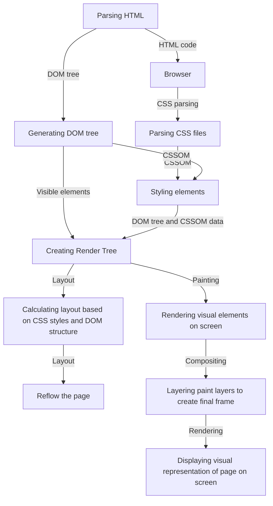

# How a Page is Rendered

## The HTML CSS JavaScript way:  

**HTML Parsing:**  
The first step is parsing the HTML document. The browser reads the HTML code from top to bottom and builds a Document Object Model (DOM) tree, which represents the structure of the page. The DOM tree consists of nodes representing HTML elements and their relationships.

**CSS Parsing and Styling:**
After parsing the HTML, the browser starts parsing the CSS (Cascading Style Sheets) files linked to the HTML document. The CSS parsing process determines the styles (e.g., color, size, font) that should be applied to each element on the page. The computed styles are then attached to the corresponding DOM nodes.

**Render Tree Construction:**  
Once the DOM and CSSOM (CSS Object Model) are ready, the browser combines them to create the Render Tree. The Render Tree represents the visual elements to be displayed on the page and includes only the elements that are visible according to the CSS styles.

**Layout (Reflow):**  
The browser calculates the layout of the elements in the Render Tree. This process is often referred to as "reflow." During reflow, the browser calculates the size and position of each visible element on the page based on the CSS styles and the DOM structure. If any changes occur that affect the layout (e.g., adding or removing elements, changing dimensions), the browser triggers a reflow for those affected elements.

**Painting:**  
After the layout is determined, the browser goes through the "painting" phase. During painting, the browser fills in pixels on the screen with the appropriate colors and images to represent the visual elements as determined by the Render Tree and layout calculations.

**Compositing:**  
Once the painting is complete, the browser may perform compositing if necessary. Compositing involves layering individual paint layers to create the final frame that will be displayed on the screen. This process allows the browser to optimize rendering and improve performance, especially when dealing with animations and complex visual effects.

**Rendering the Page:**  
Finally, the composed frame is displayed on the user's screen, creating the visible representation of the web page.  

## The React Way:  

**Component Hierarchy:**  
In React function-based components, you define components as JavaScript functions that return a React element (usually created using JSX) representing the component's UI. Function-based components can also accept props as parameters to customize their behavior.

**Element Creation:**  
To render a React application, you start by creating a "root" DOM element in the HTML file. This root element is where the React application will be mounted.

**Virtual DOM Creation:**  
When the React application is mounted, React creates a virtual representation of the UI called the Virtual DOM. The Virtual DOM is a lightweight copy of the actual DOM and is a JavaScript object representation of the React components and their structure.

**Initial Render:**  
During the initial render, React traverses the function-based component hierarchy and calls the functions to create a Virtual DOM representation of the UI. The function returns a React element (usually created using JSX) that describes the component's UI.

**Function Execution:**  
Each function-based component is executed during the initial render or whenever it receives new props. When the function is executed, it generates a new React element based on its logic and the current state and props.

**Diffing and Reconciliation:**  
After creating the Virtual DOM, React performs a process called "Reconciliation" or "Diffing" to determine what changes need to be made to the actual DOM. React compares the new Virtual DOM representation with the previous one (old Virtual DOM) to identify the minimal set of changes required.

**Generating Patches:**  
During the diffing process, React generates a set of patches or instructions that describe the changes needed to update the actual DOM to match the new Virtual DOM. These patches are a lightweight representation of the required updates.

**Updating the DOM:**  
Once the patches are generated, React applies the necessary changes to the actual DOM in a process called "committing" the changes. It efficiently updates the DOM nodes without having to rebuild the entire DOM, resulting in improved performance.

**Re-rendering:**   
Function-based components re-render whenever there are changes to their state or props. React intelligently handles re-rendering and updates only the necessary parts of the UI, thanks to the Virtual DOM and the efficient diffing algorithm.

