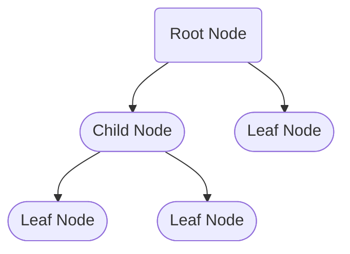

# Trees

## What is a Tree?

 A tree is a data structure that represents a *hierarchical structure*. 
 It is composed of *nodes* that are connected to each other by *edges*. 
 The topmost node of the tree is called the root node, and each node can have zero or more child nodes. 
 The nodes that have no children are called leaf nodes.
 
 



 Trees are a specific type of graph where there is a *hierarchical relationship* among the nodes. 
 Unlike general graphs, trees don't have *cycles*, which means that there is exactly one path between 
 any two nodes in the tree. 

 Another difference between trees and general graphs is that in trees, there is a single node called the *root* from 
 which all other nodes are descendants. This property makes it easy to define a hierarchy of relationships among nodes, 
 which is not the case in general graphs.

 The parent-child relationship in trees also enables the *efficient traversal* and searching of the tree. For example, in a 
 binary search tree, we can easily search for a specific value by starting at the root and comparing the value with each 
 node along the way. If the value is less than the current node, we move to the left child, and if it is greater, 
 we move to the right child. This process continues until we find the node containing the desired value or reach a leaf node 
 that does not contain the value. This efficient searching is not always possible in general graphs due to the lack of a clear 
 hierarchy of relationships.

 Having no cycles is an important property of trees because it ensures that there is only one path between any two nodes in the tree. 
 This makes it easy to traverse the tree and find information, as there is no possibility of getting stuck in an infinite loop or visiting 
 the same node multiple times.

 In addition, having no cycles makes it easier to reason about the structure and behavior of a tree, since cycles can introduce non-deterministic 
 behavior and complicate analysis. For example, in a graph with cycles, it may be difficult to determine the shortest path between two nodes, 
 since there may be multiple paths that include cycles.

 By restricting the structure of a tree to be acyclic, we limit the number of possible paths and prevent infinite loops that could occur in a graph.
 This makes it easier to reason about and manipulate tree data structures. For example, with a tree, we can perform traversal algorithms 
 (like preorder, inorder, and postorder) to visit every node in a predictable and efficient order, while with a graph, we need to consider 
 more complex algorithms that take cycles into account.


### Trees have several practical advantages:

**Efficient search and insertion:** Trees provide efficient search and insertion operations. 
 Binary search trees and balanced trees like AVL and Red-Black trees can perform operations 
 like search, insertion, and deletion in O(log n) time complexity.

```mermaid
graph TD
    subgraph Trees
    A((Root))
    B((Node))
    C((Leaf))
    A --|Search/Insert/Delete| B
    B --|Search/Insert/Delete| C
    end
    subgraph Binary Search Tree
    D((Node))
    E((Node))
    F((Node))
    G((Node))
    D --|<| E
    D --|>| F
    F --|<| G
    end
    subgraph Balanced Trees
    H(AVL)
    I(Red-Black)
    J(B-Tree)
    end
    subgraph Time Complexity
    B --O(log n)--> C
    D --O(log n)--> G
    H --O(log n)--> 
    I --O(log n)--> 
    J --O(log n)--> 
    end
```

**Hierarchical structure:** Trees represent a hierarchical structure that is easy to understand 
and interpret. This structure makes it easy to organize and store data.

**Natural model for recursive operations:** Trees provide a natural model for recursive operations.
 Many algorithms such as traversals and searches are recursive in nature and can be easily implemented using trees.

**Fast data retrieval:** Trees can be used to implement various data structures such as sets, maps, 
 and priority queues. These data structures provide fast data retrieval operations.

**Memory efficiency:** Trees can be more memory efficient than other data structures. 
 For example, a binary search tree can store the same data as an array or list with less memory.

**Better than linear search:** Trees provide a better alternative to linear search. For large datasets, 
 linear search can be inefficient, while trees can provide fast search operations even for large data sets.
 
 
