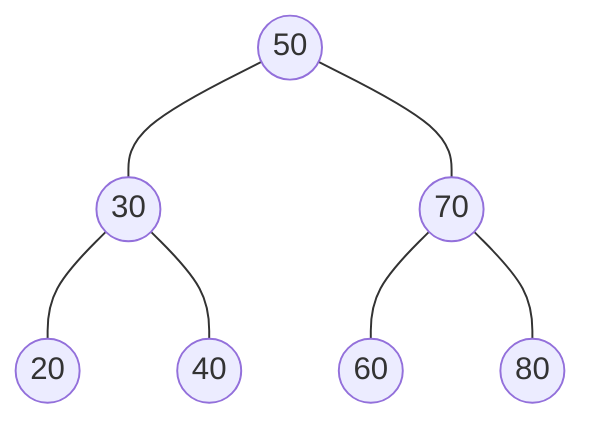
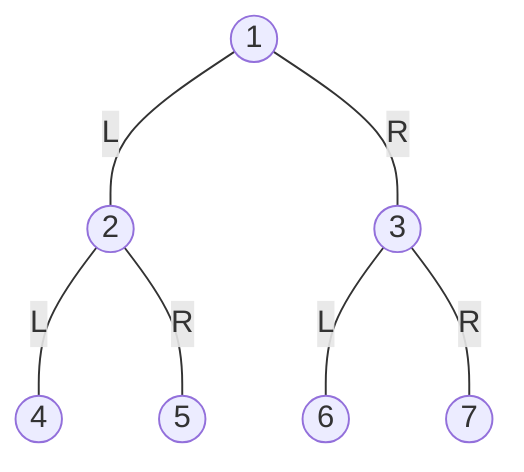
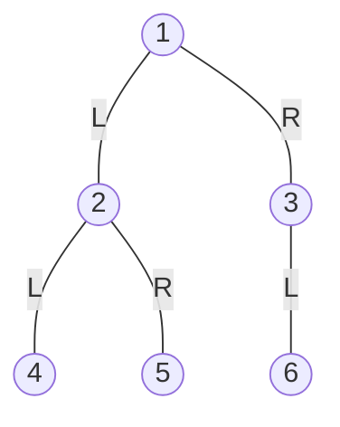
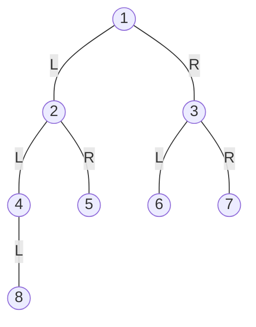

# Binary Trees

## What is a Binary Tree?

A **binary tree** is a type of tree data structure in which each node has at most two children, 
referred to as the **left child** and the **right child**. The left child is usually the smaller one 
and the right child is usually the larger one, in the context of a **binary search tree**. 
Each node in a binary tree contains a key, which could be any type of data, and a pointer to 
its left and right children, which could be null if they don't exist.

Binary trees have many uses in computer science, including as a way to represent hierarchical 
structures such as file systems, syntax trees, and expression trees. They can also be used to 
implement many other data structures, including binary heaps and binary search trees.  

In this example, the root node has a key of 50, its left child has a key of 30, and its right child 
has a key of 70. The left child has two children of its own with keys of 20 and 40, and the right 
child has two children of its own with keys of 60 and 80. This binary tree is not a binary search tree 
because the left child's right child has a key greater than its parent.  

## Types of Binary Tree

 **There are several types of common binary trees:**  
 
**Full binary tree:** A binary tree is said to be a full binary tree if every node in the tree has either zero or two children. 
In other words, every node has either two or no children.  

  
**Complete binary tree:** A binary tree is said to be a complete binary tree if all levels of the tree are completely filled, 
except possibly for the last level, which must be filled from left to right.  

  
**Perfect binary tree:** A binary tree is said to be a perfect binary tree if all of its levels are completely filled.  

  
**Balanced binary tree:** A binary tree is said to be a balanced binary tree if the heights of its two subtrees never differ 
by more than one. Some common types of balanced binary trees include AVL trees and Red-Black trees.  

